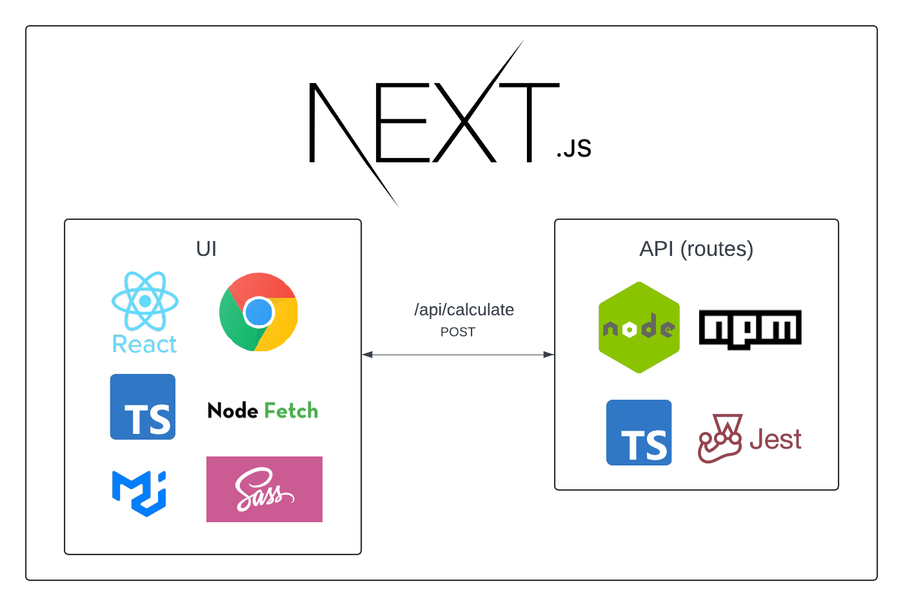
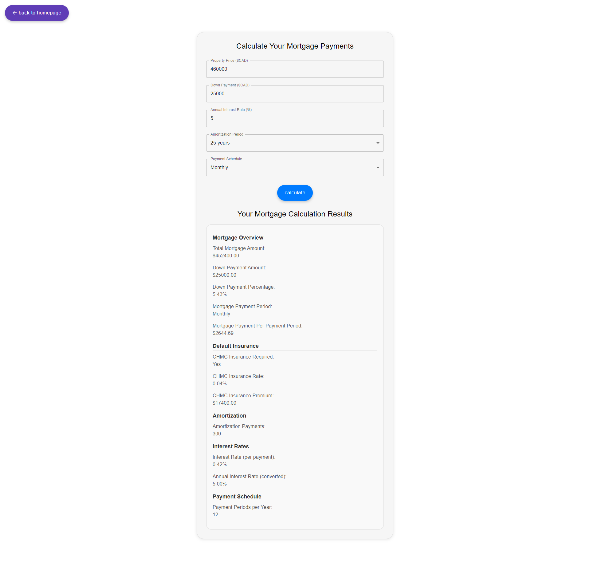

# Mortgage Calculator Application & API

This project is a Next.js application built with TypeScript. It features a web-based mortgage calculator that helps 
users estimate their mortgage payments based on various inputs. 
This repository includes both the frontend implementation with React and Material-UI, 
and an API route for mortgage calculations.

## Project Tech Stack

The tech stack I have chosen for this project combines modern, efficient technologies for building scalable, maintainable, and high-performing applications.
React and Next.js provide a powerful UI and server-side framework,
while TypeScript enhances code quality. SCSS and MUI contribute to a polished user experience,
and Fetch and Jest support robust client-server communication and testing.



## Frontend

### React with Next.js 13
- **React**: JavaScript library for building user interfaces, supporting reusable components and efficient state management.
- **Next.js 13**: The most popular React framework providing server-side rendering, static site generation, and API routes for improved performance and SEO.

### TypeScript
- Superset of JavaScript that adds static types for better code quality and early error detection.

### Scoped SCSS
- SCSS scoped to components for encapsulated styles, preventing conflicts and simplifying management

### MUI 6
- Material UI component library for building modern, accessible user interfaces with Google's Material Design.

### Fetch API
- Modern JavaScript API for making HTTP requests, offering flexibility and ease of use.

## Backend

### Next.js API Routes
- Allows building API endpoints within the same codebase as the frontend, ideal for server-side logic and interactions.

### TypeScript
- Ensures consistent type-checking on the backend, improving code quality and developer experience.

### Jest
- A popular testing framework for JavaScript, suitable for unit testing logic such as mortgage calculations, with features like mocking and code coverage.

## Getting Started

First, clone the repository and navigate into the project directory:

```bash
git clone https://github.com/your-username/mortgage-calculator-api.git
cd mortgage-calculator-api
```

Install your packages:

```bash
npm install
```

Then, run the development server:

```bash
npm run dev
```

Open [http://localhost:3000](http://localhost:3000) with your browser to see the application running.

You can start editing the page by modifying `app/page.tsx`. The page auto-updates as you edit the file.

This project uses [`next/font`](https://nextjs.org/docs/basic-features/font-optimization) to automatically optimize and load Inter, a custom Google Font.

## Running Automated Unit Tests with Jest
To ensure the accuracy of the 'calculator' API route, which contains the core logic for calculating a mortgage based on user inputs from the UI, 
you can run my automated unit tests using Jest. This process will help verify that the mortgage calculation logic 
is functioning correctly. Here’s how to do it:

1. Navigate to the Project Directory:
```bash
cd mortgage-calculator-api
```

2. Install Dependencies (if you haven’t already):

```bash
npm install
```

3. Run the Tests:

```bash
npm test
```

This command will execute the Jest testing framework and run all the unit tests defined in the project. 
You should see output similar to the following:

```bash
PASS  src/app/api/calculate/helpers.test.ts
 validateUserInputFromClient
   ✓ should return an error for invalid property price (3 ms)
   ✓ should return an error for invalid down payment (1 ms)
   ...
 calculateCMHCInsurancePremium
   ✓ should calculate the insurance premium for a given rate and mortgage amount
   ...

Test Suites: 1 passed, 1 total
Tests:       37 passed, 37 total
Snapshots:   0 total
Time:        1.397 s
Ran all test suites.
```

## Screenshots

Here are some screenshots of the application:

**Home Page:**


_The home page of the Mortgage Calculator application._

**Mortgage Calculator Page:**


_The main page of the Mortgage Calculator where users can input their mortgage details._

**Mortgage Calculator with all Validation Errors:**


_The Mortgage Calculator page displaying validation errors for user inputs._

**Validation Error for Down Payment:**


_An example of validation error indicating that the down payment is too low._

**Mortgage Calculation Results without Default Insurance:**


_Results of a mortgage calculation where default insurance is not required._

**Mortgage Calculation Results with Default Insurance:**


_Results of a mortgage calculation including details on default insurance when it is required._